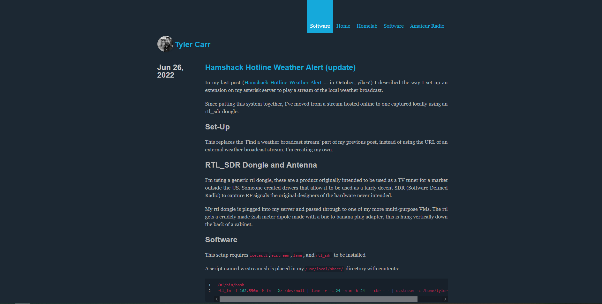

# Blue Penguin for pelican
A simple theme for pelican. Solarized pygments. Feeds support.

## Contributors
* [Nevan Scott](https://github.com/nevanscott/Mockingbird) (original author)
* [wrl](http://github.com/wrl) (port to pelican, pelican-mockingbird)
* [Jody Frankowski](http://github.com/jody-frankowski) (Blue Penguin)
* [Grimbox](https://github.com/Grimbox)
* [ix5](https://github.com/ix5)

## License
Public domain.
